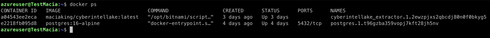
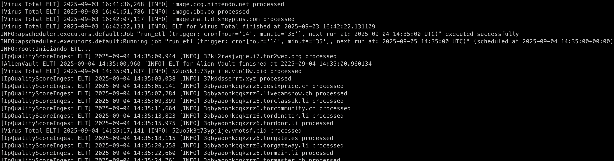
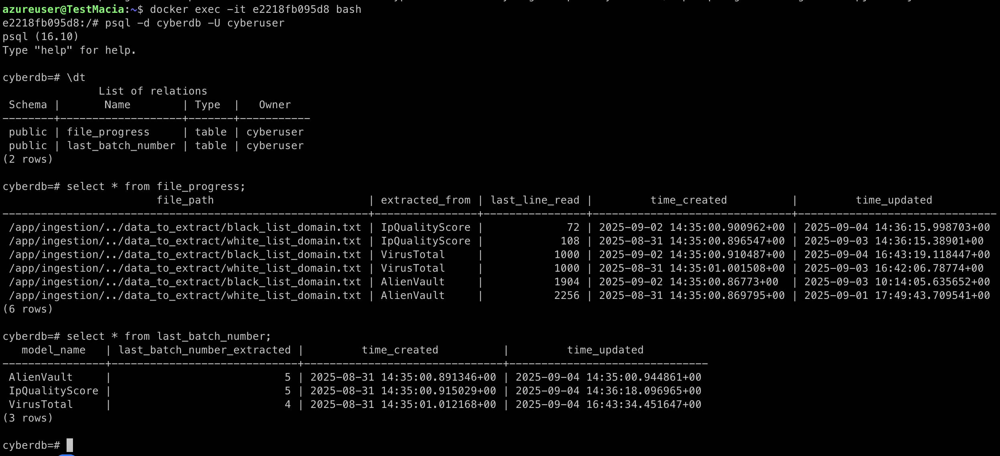

# CyberIntelLake

**CyberIntelLake** is a platform for ingesting and processing cyber threat intelligence.  
It currently supports data extraction from the following sources:  

- [VirusTotal](https://www.virustotal.com/)  
- [AlienVault OTX](https://otx.alienvault.com/)  
- [IPQualityScore](https://www.ipqualityscore.com/)  

The project follows a **Raw → Silver → Gold** architecture, enabling data storage and transformation into different maturity layers for advanced analysis.

---

## 🚀 Architecture

- **Raw**: Direct ingestion of data from external APIs.  
- **Silver**: Data cleaning and normalization.  
- **Gold**: Data ready for exploitation (dashboards, advanced queries, correlations).  

The project is fully **dockerized** and can be easily run both in development and production environments.  

---

## ⚙️ Configuration

Before deploying, you must configure the `.env` file in the project root.  

Example of required variables:  

```ini
# API Keys
VT_API_KEY=your_virustotal_api_key
AV_API_KEY=your_alienvault_api_key
IP_QUALITY_SCORE_KEY=your_ipqualityscore_api_key

# Database configuration
DB_USER=user
DB_PASSWORD=password
DB_HOST=db
DB_PORT=5432
DB_NAME=cyberintel
```

## ⚙️ Production with swarm
### 🔧 Local Build & Push
1. Tag the image for your Docker Hub repository.
```
docker tag cyberintellake-cyberintellake maciaking/cyberintellake
```

2. (Optional) If you are using MAC-ARM, build for linux/amd64 to ensure compatibility.
```
export DOCKER_BUILDKIT=1
docker buildx build --platform linux/amd64 -t maciaking/cyberintellake:latest .
```

3. Push the image to Docker Hub.
```
docker push maciaking/cyberintellake
```

### 🚀 Server-Side Deployment

4. Copy your .env file to the server (contains API keys and DB credentials).
```
scp .env user@your_server:/your_path
```

5. Pull the required images on the server
```
docker pull maciaking/cyberintellake:latest
docker pull postgres:16-alpine
```

6. Initialize Docker Swarm.
```
docker swarm init
```

7. Create an overlay network to connect services (extractor ↔ database).
```
docker network create -d overlay cyberintellake_network
```

8. Create a volume for persistent data storage.
```
docker volume create cyberintellake_data
```

### 📦 Deploy Services
9. Start the PostgreSQL service (make sure it starts before the extractor).

```
docker service create \
  --name postgres \
  --replicas 1 \
  --publish 5432:5432 \
  --network cyberintellake_network \
  --env-file .env \
  postgres:16-alpine
```

10. Start the CyberIntelLake extractor service.
```
docker service create \
  --name cyberintellake_extractor \
  --env-file .env \
  --network cyberintellake_network \
  --mount type=volume,source=cyberintellake_data,target=/app/data \
  maciaking/cyberintellake:latest
```

## 📜 Viewing Production Logs

View running services.
```
docker ps
```


Example logs from the running production image:
```
docker logs a04543ee2eca
```


Example of database status.
```
docker exec -it e2218fb095d8 bash
psql -d cyberdb -U cyberuser
```


## 📊 Created Dataset: CyberIntelLake Threat Intelligence

Thanks to the development of this project, it was possible to generate a **cybersecurity dataset** that collects relevant information for threat analysis and detection models. This dataset is available on [Kaggle](https://www.kaggle.com/datasets/macisalvsalv/cybersecurity-dataset) and contains structured data that allows for exploring behavioral patterns and improving cybersecurity solutions.

The creation of this dataset is an additional contribution derived from this project, enabling other researchers and professionals to use it as a reference or a base for their own cybersecurity studies.

###  Data backup
If you want to access a **backup of the original data** used to create this dataset, it is available at the [CyberIntelLake_data GitHub repository](https://github.com/MaciaKing/CyberIntelLake_data).  
This backup allows users to explore and analyze the data **without having to run the extraction pipeline**.

